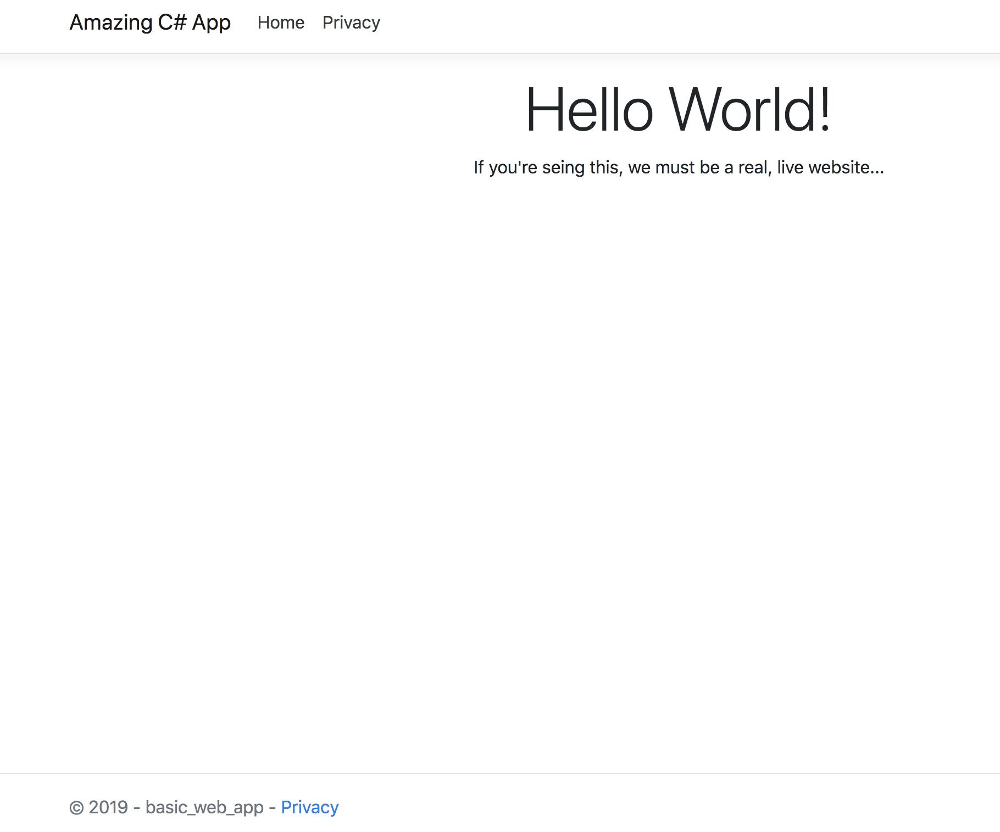

# Code Pipeline for C#
## C# Application folder
1. Add buildspec.yml file.
```
version: 0.2

phases:

build:
commands:
  - dotnet restore deployment-app-csharp/basic-web-app/basic-web-app.csproj
  - dotnet build deployment-app-csharp/basic-web-app/basic-web-app.csproj
  - dotnet publish deployment-app-csharp/basic-web-app/basic-web-app.csproj -o site
 artifacts:
  files:
    - deployment-app-csharp/site/**/*
    - deployment-app-csharp/aws-windows-deployment-manifest.json
```
2. Add aws-windows-deployment-manifest.json file
```

{
  "manifestVersion": 1,
  "deployments": {
      "aspNetCoreWeb": [{
              "name": "deployment-app-csharp",
              "parameters": {
                  "appBundle": "./basic-web-app/site",
                  "iisPath": "/",
                  "iisWebSite": "Default Web Site"
              }
          }
      ]
  }
}
```
To see more details, check out: https://github.com/nguyenvinh2/deployment-app-csharp

## Setting up pipeline in AWS:
1. Click create pipeline in CodePipeline
2. On pipeline settings, enter pipeline name. Click next.
3. Under source provider, select Github and connect to github. Enter credentials. 
4. Select repository and master branch, then click next.
5. Skip Build stage. Click Skip to confirm.
6. Under Deploy provider, select Elastic Beanstalk (Ensure EB is already set-up). Select corresponding application and environment names. Click next.
7. Click Create Pipeline. Wait for confirmation.


## Roadblocks
1. Buildspec yml and mainfest files should be added on the application folder.
2. Figuring out vague error messages.

## Deployed site
http://dotnetrun-env.ctrwv48puz.us-west-2.elasticbeanstalk.com/

## Repeatability
Any changes on github source, is reflected on the deployed site.


## Group:
* Vinh Nguyen
* Stephen Chu
* Cristian Restrepo
* Jorie Fernandez

